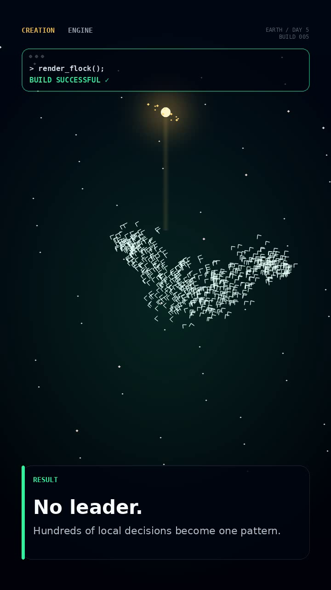

# CREATION ENGINE — Birds



A vertical 9:16 generative animation that explores a simple question:

> **What if this is how God created a flock of birds?**

The project turns the classic **Boids** idea into a short visual story: birds begin in chaos, then gain three local rules — **separation, alignment, and cohesion** — until a flock emerges.

The final synchronized murmuration is intentionally more cinematic than the raw Boids simulation. It is used as the visual payoff of the short, not as a fourth canonical Boids rule.

## Concept

The project uses an abstract golden presence instead of a literal image of God. The goal is to suggest a creative force while keeping the visual language minimal, technological, and open to interpretation.

The story progression is:

1. System boot
2. Birds are created
3. Chaos
4. Separation
5. Alignment
6. Cohesion
7. Synchronized flock
8. Boids / emergence reveal
9. Teaser for the next build: ants

## The three rules

### Separation

Each bird avoids getting too close to nearby birds.

### Alignment

Each bird adjusts its direction toward the direction of nearby birds.

### Cohesion

Each bird moves toward nearby members of the flock.

No bird needs to know the final shape of the flock. Complex collective behavior emerges from simple local decisions.

## Project structure

```text
creation-engine-birds/
├── index.html                # Standalone browser version
├── narration.txt             # Voice-over text for ElevenLabs
├── requirements.txt          # Python dependencies
├── README.md
├── assets/
│   └── preview.png
└── src/
    └── render_birds.py       # Reproducible video + procedural audio renderer
```

## Browser version

The easiest way to preview the project is to open:

```text
index.html
```

No JavaScript library or CDN is required.

The page is completely standalone and runs with native HTML Canvas + JavaScript.

Press **Space** to restart the sequence.

### GitHub Pages

Because the browser version is a single `index.html`, you can also publish it with GitHub Pages:

1. Open the repository settings.
2. Go to **Pages**.
3. Select **Deploy from a branch**.
4. Choose the `main` branch and `/root` folder.
5. Save.

GitHub will publish the interactive version as a web page.

## Render the final MP4

The Python renderer reproduces the cinematic version, including the stronger synchronized flock at the end.

### 1. Create a virtual environment

```bash
python -m venv .venv
```

### 2. Activate it

Windows PowerShell:

```powershell
.\.venv\Scripts\Activate.ps1
```

macOS / Linux:

```bash
source .venv/bin/activate
```

### 3. Install the dependencies

```bash
pip install -r requirements.txt
```

### 4. Render

```bash
python src/render_birds.py
```

The generated files will be placed in:

```text
output/
```

The renderer creates:

```text
creation_engine_birds_silent.mp4
creation_engine_birds_soundtrack.wav
creation_engine_birds_final.mp4
creation_engine_birds_voice_ready.mp4
```

`creation_engine_birds_voice_ready.mp4` uses a quieter soundtrack so a narration track can be added without fighting the music and sound effects.

To render only the silent video:

```bash
python src/render_birds.py --skip-audio
```

To choose another output folder:

```bash
python src/render_birds.py --output-dir renders
```

## Audio

The soundtrack is generated procedurally in Python.

It uses synthesized tones, filtered noise, impacts, sweeps, and small harmonic layers to reinforce the progression from **chaos to order**.

No external music file is required by the renderer.

The audio design follows the visual structure:

- boot → low cosmic ambience
- creation → rising sweep and sparkle
- chaos → tension and dissonance
- separation → first impact
- alignment → brighter harmonic step
- cohesion → stronger resolution
- final flock → wider sustained chord
- Boids reveal → short discovery cue
- ants teaser → closing notes

## Narration

The narration is intentionally kept separate so the voice can be generated in ElevenLabs and mixed later.

The current script is available in [`narration.txt`](narration.txt).

Opening line:

> **Here's how I imagine God creating a flock of birds.**

Suggested delivery: curious, thoughtful, warm, and slightly playful rather than overly dramatic.

## Scientific note

The animation is inspired by the Boids model of flocking behavior, commonly described through three local behaviors:

- separation
- alignment
- cohesion

The synchronized ribbon used after the three rules is a **cinematic presentation layer** added to make the final flock read clearly in a short-form video. It should not be interpreted as an additional original Boids rule.

## Creative direction

The visual system was designed around a reusable fictional interface called **CREATION ENGINE**.

This makes the concept expandable into future episodes such as:

```text
> next("ants");
> next("trees");
> next("snowflakes");
> next("sunflowers");
```

Possible future topics include ant colony optimization, recursion and L-systems, fractals, phyllotaxis, reaction-diffusion, orbital simulations, and other examples where simple rules create complex behavior.

## Customization

The main values are near the top of `src/render_birds.py`:

```python
W, H = 720, 1280
FPS = 30
DURATION = 41.0
BIRD_COUNT = 650
```

The timeline is controlled by:

```python
SCENES = [
    (0.0, "boot"),
    (2.6, "create"),
    (6.2, "chaos"),
    (9.0, "sep"),
    (14.0, "ali"),
    (19.0, "coh"),
    (24.0, "flow"),
    (32.0, "science"),
    (37.0, "next"),
]
```

Colors are stored in the palette constants at the top of the same file.

## Why this project exists

The goal is not simply to display an algorithm.

It is to make programming, mathematics, and emergent behavior understandable through a visual story — even for viewers who would never normally watch a programming tutorial.

**Simple rules. Complex behavior.**
